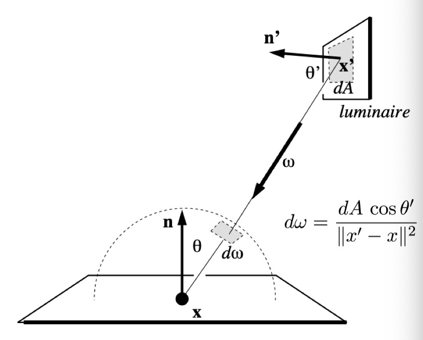

# 基础结构

## Bound3

三维包围盒,将图元包围到与坐标轴平行的包围盒,快速判断求交


## BVH
 
 boundary volume hierarchy, 基于模型而非空间.


构建: 

1. 找出所有对象包围盒的并
2. 按最长的维度排序,从中间划分成两个子集(包围盒可能相交)
3. 递归构建子集
4. 当对象数量到达一定限制时停止,并将对象存在叶子上

求交:

1. 与包围盒求交,如果失败则返回
2. 如果是叶子,则与对象求交
3. 递归与左右儿子求交,返回t(交点时间)最小的.

## Material

材质实现了漫反射和光滑表面(颜色与法向量夹角和高光项相关)

### sample 

漫反射: 在单位球面上随机取一点
光滑: $cos(\theta) = \sqrt[specular]{rand()}$

### eval

根据入射和出射方向算贡献

漫反射: $\frac{1}{\pi}$

### pdf 

出射,入射方向和法向量算概率密度函数

## 渲染方程 与 蒙特卡洛求解

BRDF(Bidirectional Reflectance Distribution Function)双向反射分布函数

$f(l,v) = \frac{dL_o(v)}{dE(l)}$

其中f是BRDF,l是入射光方向,v是观察方向,也就是想要的反射光方向  
$dL_o(v)$是表面反射到v方向的反射光的微分辐射率.表面反射到v方向的辐射率为$L_o(v)$,来自于表面上半球所有方向的入射光的贡献,而微分辐射率$dL_o(v)$特指来自方向v的入射光贡献的反射辐射率.  
$dE(v)$是表面上来自入射光方向l的微分辐照度.表面接收到的辐照度为E,来自上半球方向入射光线的贡献,而微分辐照度$dE(l)$特指来自方向l的入射光

反射方程: 针对一个着色点,积分所有方向的输入源的BRDF

$$L_r(p,w_r) = \int_{H^2}f_r(p,w_i \to w_r)L_i(p,w_i)cos\theta_idw_i$$

渲染方程: 反射方程+物体本身发光

$$L_r(p,w_r) = L_e(p,w_o)+ \int_{H^2}f_r(p,w_i \to w_r)L_i(p,w_i,w_o)(n\cdot w_i)dw_i$$

求解:  
蒙特卡洛积分 $\int f(x)dx = \frac{1}{N}\sum_{i=1}^N\frac{f(X_i)}{p(X_i)} \quad X_i \sim p(x)$

但求和复杂度依旧很大,且为递归函数难以求解,采用俄罗斯轮盘赌,只以一定概率射出一条光线,结果除以概率.  
期望是正确的但会出现噪声.

定义在material中 $f(x_i) : eval, p(x_i) : pdf$

对光源采样:

光源较小时,随机射出光线很难击中光线,直接在光源上采样,看能否击中物体.



```python
shadeOnLight: ray
    interset(ray)
    if (!hit)
        return backgroundColor
    if (hitLight)
        return lightColor
    // calculate direct light
    light,pdf_light = sampleLight()
    if (light can hit obj)
        L_dir = L_i * f_r * cos(theta) * cos(theta') / |x' - p|^2 / pdf_light
    else 
        no direct light Color

    // contribution from other reflectors
    Test Russian Roulette with probability P_RR
    wi = sample(Obj)
    interset(wi)
    if (hit a non-emitting object at q)
        L_indir = shadeOnLight(-wi) * eval() * cos(theta) / pdf() / P_RR

    return L_dir + L_indir
```

对BRDF采样:

对于一些特殊的材质(粗糙),对BRDF更能显示它的性质(粗糙表面对于光源采样时,噪点会比较多,因为就算光线照到表面,也会因为pdf低而不明显,采样BRDF能在物体表面得到充分采样,不会产生大量噪点)


```python
shadeOnBRDF: ray
    interset(ray)
    if (!hit)
        return backgroundColor
    if (hitLight)
        return lightColor

    Test Russian Roulette with probability P_RR

    wi = sample(Obj)
    interset(wi)

    if (hit light) {
        Lo = lightColor
    } else if (hit something) {
        Lo = shadeOnBRDF(wi)
    }
    Lo = Lo * eval() * cos(theta) / P_RR / pdf()
    return Lo
```

怎样混合?

估算对方的概率(通过面积)

BRDF: pdf() / obj.area()
Light: $\frac{1}{solidangle}$